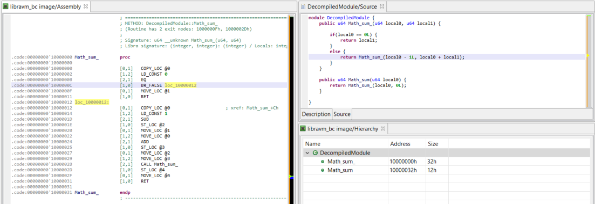

# Libra decompiler plugin for JEB

This set of plugins provide [Libra](https://github.com/libra/libra/) decompilation (libravm/Move) support for JEB Decompiler.

Required version: JEB 3.6-beta [(download)](https://www.pnfsoftware.com/dl?jebdemo)

## Usage
- JEB 3.6-beta ships with the compiled plugin version 0.1.0
- Open a compiled Libra module or script in JEB (they start with the <code>libravm</code> magic bytes)
- JEB will start the analysis and behind-the-scene decompilation to restore the module
- The disassembly will be displayed
- In the code hierarchy view, select either the "main" or "Decompiled Module" node and hit the TAB key to display the decompiled code



## Source

Make sure to define <code>JEB_HOME</code> environment variable and have it point to your JEB folder

### Eclipse IDE Project
- Run the appropriate <code>create-eclipse-project-xxx</code> to create the Eclipse project files
- In Eclipse: File, Import, Java Project... 

### Building
- Run the appropriate <code>build-xxx</code> script 
- Output goes to <code>out/JebLibraPlugin-VERSION.jar</code>; copy the file to your JEB <code>coreplugins/</code> folder

## License
```
JEB Copyright PNF Software, Inc.

https://www.pnfsoftware.com

Licensed under the Apache License, Version 2.0 (the "License");
You may not use this file except in compliance with the License.
You may obtain a copy of the License at

http://www.apache.org/licenses/LICENSE-2.0

Unless required by applicable law or agreed to in writing, software distributed under the License is distributed on an "AS IS" BASIS, WITHOUT WARRANTIES OR CONDITIONS OF ANY KIND, either express or implied. See the License for the specific language governing permissions and limitations under the License.
```